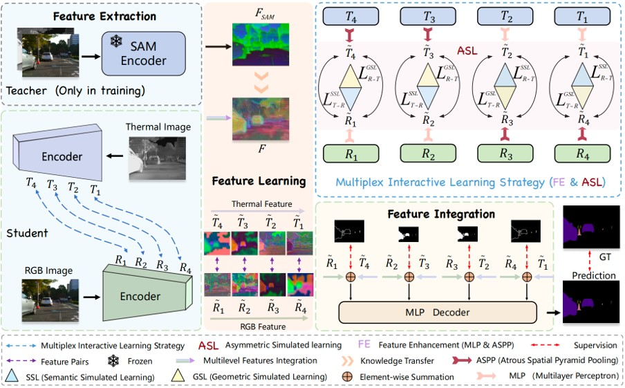

# MiLNet
Code and result about MiLNet(IEEE TIP) 
MiLNet: Multiplex Interactive Learning Network for RGB-T Semantic Segmentation [IEEE TIP](https://ieeexplore.ieee.org/document/10908980)

# Requirements
conda env create -f environment.yaml

# Dataset and Evaluate tools

 The MFNet datesets for RGB-T semantic segmentation could be found in [GoogleGrive](https://drive.google.com/file/d/11dqniIYqBMnuRnrVbC4v-62dEm_O9PIx/view?usp=sharing)  
 (We also provide the label.) ,  
 The PST900 datesets for RGB-T semantic segmentation could be found in [GoogleGrive](https://drive.google.com/file/d/1fx_QPzwfaEPnWcDXg94DfNYbQtC9y4Ip/view?usp=sharing)  

# Pretrained model & Result
[Backbone]Pretrained model download:[GoogleGrive](https://drive.google.com/file/d/1J1GtZSzUcJoWni9ja7uf3h7wgNnIHDAG/view?usp=sharing)  
[MFNet]Pretrained model download:[GoogleGrive](https://drive.google.com/file/d/1w0bhA6H39oubk8qo4ttnC7Xt7hm53lf5/view?usp=sharing), and Predict results download:[GoogleGrive](https://drive.google.com/file/d/1UIr0eMEGlGcECMmlgjN7O4YQMFYl7I2a/view?usp=sharing)    
[Pst900]Pretrained model download:[GoogleGrive](https://drive.google.com/file/d/19rGER7YSv9POyMTphI1QSeL-8FGcVLgS/view?usp=sharing), and Predict results download:[GoogleGrive](https://drive.google.com/file/d/1vQKPQPmvZppuFmY5yliltNZ0VojoOL0V/view?usp=sharing)   

# Citation
@article{liu2025milnet,  
  title={MiLNet: Multiplex Interactive Learning Network for RGB-T Semantic Segmentation},  
  author={Liu, Jinfu and Liu, Hong and Li, Xia and Ren, Jiale and Xu, Xinhua},  
  journal={IEEE Transactions on Image Processing},  
  volume={}, 
  number={},  
  pages={1-14}, 
  year={2025},  
  doi={10.1109/TIP.2025.3544484}},  
}

# Acknowledgement
The implement of this project is based on the code of ‘MMSMCNet: Modal Memory Sharing and Morphological Complementary Networks for RGB-T Urban Scene Semantic Segmentation (https://github.com/2021nihao/MMSMCNet)’ proposed by Wujie Zhou and Han Zhang et all.

# Contact
Please drop me an email for further problems or discussion: liujinfu@stu.pku.edu.cn

